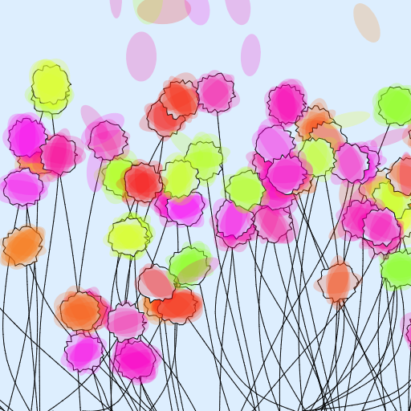
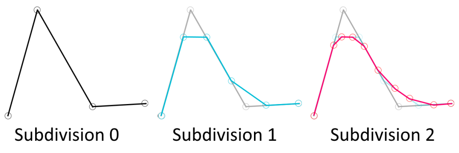

# flowers

## Description
This is a naive project painting a flower field. Over time, each flower loses its petals to the wind and eventually dies, only to be replaced by a new one.

The stems are modelized as weightless ropes and animated with Verlet integration.

See it live [here](https://piellardj.github.io/flowers/?page%3Acanvas%3Afullscreen=true).

## Details

This project was inspired by still pictures from user [moPsych](https://github.com/moPsych).

### Rope physics
The flower stems are modelized as ropes. A rope is seen as a chain of nodes linked by very stiff springs. There are two constraints:
- the first node (root of the flower) is fixed
- the distance between consecutive nodes is fixed

In this scene the gravity does not apply to the rope itself, the only source of movement is the flower corolla which is moved by the wind and gravity.

For each update step:
- each node's position is updated with Verlet integration
- then to make sure the constraints are mostly satisfied, I run an adjustment step an arbirary number of times. Since in this scene the movements are quite slow, a dozen of times is enough.

### Line interpolation
Each rope is only made of a few segments because I think it gives more interesting movements. However I still wanted the stems to look smooth, so before drawing them I smoothen the lines by computing a full Chaikin subdivision. This is suboptimal because I only need to subdivide the parts that have steep angles (no need to subdivide segments that are aligned in a straight line).

### Performance
In this project, the computation itself is not very expensive. The expensive part if the drawing part.

This project uses Canvas2D API for drawing. The scene is made of lines, polygon and ellipsis. As usual, Canvas2D is not great performance-wise and WebGL would probably be faster.

In every drawing framework, the main optimisation is to reduce state changes (stroke styles, fill etc.) by doing the drawing in batches. However even if this scene looks 2D, some flowers are at the front while others are in the back. Since Canvas2D doesn't have depth buffer, the simplest way to simulate this is to preserve the flwoers drawing order of flowers. This is suboptimal because drawing a single corolla requires 1 state change (petals and outline), so drawing N corollas one by one implies N state changes. The only thing I can do is draw all stems at once because they are all at the back. With WebGL support, I could take advantage of the depth buffer to further reduce state changes: I could draw all stems at once, then all petals at once, yhen all corollas at once.

One interesting thing I found is that on my mobile device, asking Canvas2D to draw a line with a width of 2 is absurdly more expensive than a line of 1 pixel. I did not find much information on this issue. My guess is that Chrome uses a WebGL backend for Canvas2D. Since on this device, the max line width supported by WebGL is 1 (`gl.ALIASED_LINE_WIDTH_RANGE` attribute), drawing a 1-pixel wide line is straightforward, whereas drawing a wider line requires expensive technique such as triangulating the line.

Also, IE11 doesn't support `CanvasRenderingContext2D.ellipse` drawing with Canvas2D, so I use the `CanvasRenderingContext2D.arc` API to draw circles as a fallback.